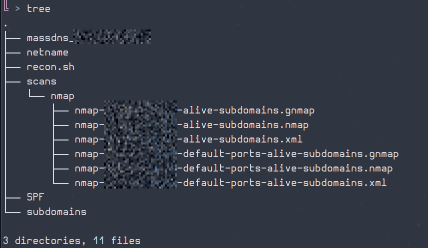

# Paranoid Recon — Subdomain Enumeration

**Paranoid Security & Dark OSINT - Linux-first offensive workflows**

This repository contains a opinionated script to automate subdomain enumeration and quick host filtering.
It’s intended as a building block for recon during bug bounty, pentest, red team prep, or OSINT infrastructure mapping.

> **Use only on targets you are authorized to test.**
> Do not run this tool against hosts/domains that are out-of-scope or without permission.

---

## Features

- Enumerates subdomains using multiple tools
- Filter alive hosts
- Scans alive hosts for open ports
- *Work in progress*
  - Automate looking for web applications/services
  - Scan with `nuclei` for known vulnerabilities
  - Produces output files ready for follow-up scanning
  - Use dns bruteforcing to find more hosts

---

## Quick Start

### Requirements

Make sure you have the following tools installed and in your `$PATH`:
- [assetfinder](https://github.com/tomnomnom/assetfinder)
- [subfinder](https://github.com/projectdiscovery/subfinder)
- [massdns](https://github.com/blechschmidt/massdns)
- [anew](https://github.com/tomnomnom/anew)
- [jq](https://jqlang.org/)
- [openssl](https://www.openssl.org/)
- [curl](https://curl.se/docs/manpage.html)
- [nmap](https://nmap.org/)
- (Optional) [censys](https://censys-python.readthedocs.io/en/stable/quick-start.html) **Requires paid API key**
- (Optional) [chaos](https://chaos.projectdiscovery.io/) **Requires paid API key**

### Run

Clone the repo and scan the domain you want:

```bash
git clone https://github.com/paranoidsec/paranoid-recon.git && cd paranoid-recon
chmod +x recon.sh
./recon.sh example.com
```

### Example

```bash
# Enumerate one domain
./recon.sh hackerone.com
# Enumerate subdomains for a list of domains
cat domains | xargs -I{} -P1 ./recon.sh {}
```

It create the following files:
- `subdomains` with all the domains and sub-domains found
- `massdns_${domain_name}` with the DNS resolution for all the subdomains found for a particular domain
- `netname` with the information discovered from censys about the certificate
- `SPF` with the IPs or domains discovered from the SPF DNS record

For the scan part it creates the following directory structure:
- `scans` folder to store all the scans
    - `nmap` folder with all the `nmap` scans with the name of the domain on the files



*Screenshot is sanitized and for demonstration only — no live targets or PII.*

## Roadmap

- [x] Subdomain enumeration
- [x] Live host filtering
- [x] Service discovery and vulnerability scanning
- [x] Scope monitoring
- [ ] Add `--bruteforce` option to find hosts based on DNS bruteforcing
- [ ] Installation script

> For the actionable task list and execution priorities, see [TODO.md](TODO.md).

## Monitor (new in v0.3)

ParanoidRecon now includes a **monitoring subsystem**, currently customized for **YesWeHack** bug bounty scopes.

### What it does

- Enumerates subdomains (`recon.sh`)
- Compares with the previous run (`subdomains.bak`)
- Outputs only the *newly discovered subdomains* (`new_subs`)
- Sends a telegram notification (Optional)

### Notes

- ⚠️ Optimized for YesWeHack program scopes.  
- Only shows **deltas** (new subdomains since last run).  
- Use responsibly: only on domains you are authorized to test.  

👉 See [monitor/](monitor/) for details and usage.

## License

This project is licensed under the [MIT License](LICENSE)
